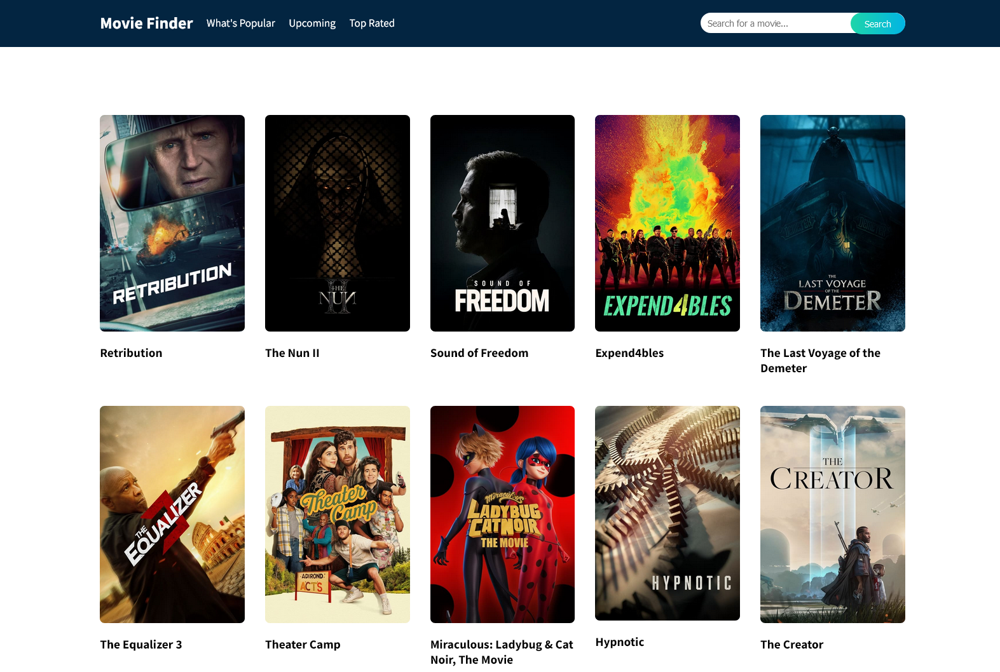

# Movie Finder App

A simple web application for searching and viewing movie details using the TMDb API. It was part of the Altcademy ReactJS Development course.



## Table of Contents

- [Movie Finder App](#movie-finder-app)
  - [Table of Contents](#table-of-contents)
  - [Features](#features)
  - [Getting Started](#getting-started)
    - [Prerequisites](#prerequisites)
    - [Installation](#installation)
- [Clone the repository](#clone-the-repository)
- [Navigate to the project directory](#navigate-to-the-project-directory)
- [Install project dependencies](#install-project-dependencies)
- [Create a .env file with your TMDb API key](#create-a-env-file-with-your-tmdb-api-key)
- [Start the development server](#start-the-development-server)
- [After running the above commands,](#after-running-the-above-commands)
- [You can search for movies, view their details, and even watch trailers if available.](#you-can-search-for-movies-view-their-details-and-even-watch-trailers-if-available)

## Features

- Search for movies by title
- View detailed information about a specific movie
- Play movie trailers (if available)

## Getting Started

### Prerequisites

Before you begin, ensure you have met the following requirements:

- Node.js and npm installed on your machine.

### Installation

```bash
# Clone the repository
git clone https://github.com/your-username/movie-finder-app.git

# Navigate to the project directory
cd movie-finder-app

# Install project dependencies
npm install

# Create a .env file with your TMDb API key
echo "REACT_APP_API_KEY=your-tmdb-api-key" > .env

# Start the development server
npm start

# After running the above commands, 
open your web browser and visit http://localhost:3000 to access the Movie Finder App.

# You can search for movies, view their details, and even watch trailers if available.
